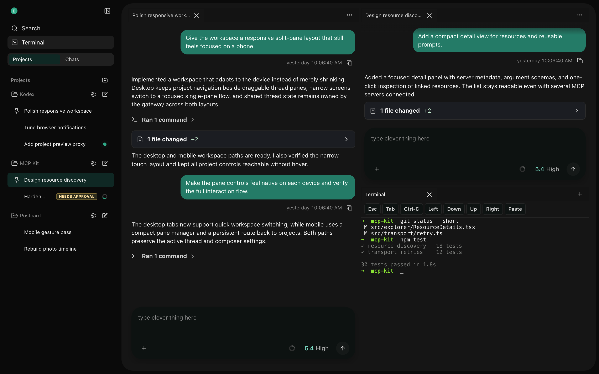
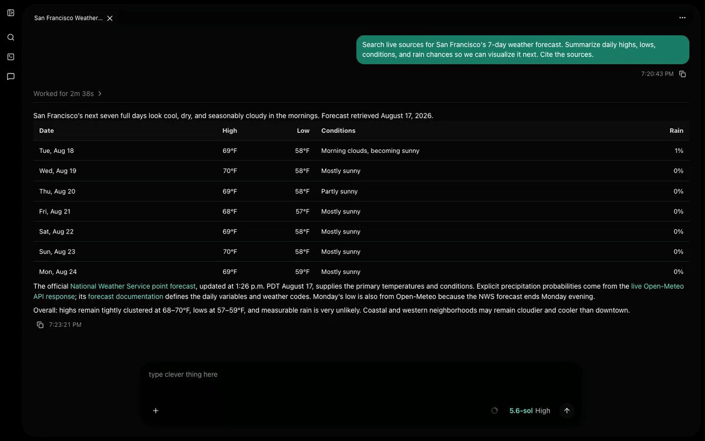
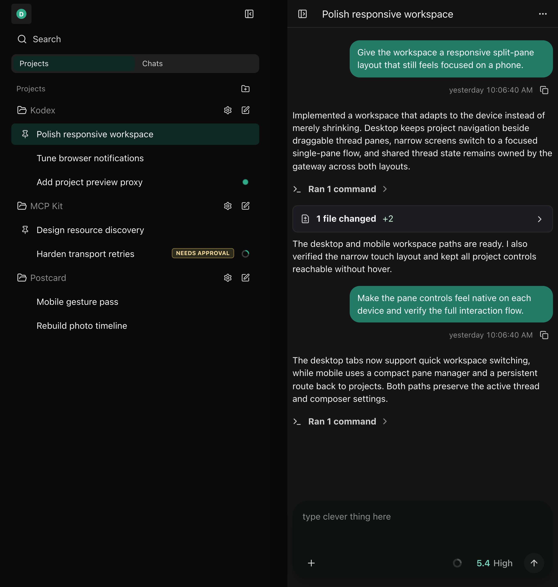
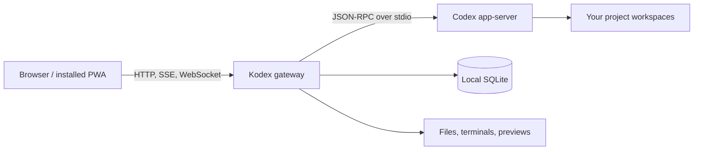

<p align="center">
  
</p>

# Kodex

Kodex is a self-hosted web workspace for [OpenAI Codex](https://github.com/openai/codex). It lets you run Codex on your own machine and work with it from a desktop or mobile browser, while keeping project files, terminals, and gateway-owned data on that machine.

It is built for personal use over localhost or a trusted private network—not as a public SaaS service. A Rust gateway manages Codex and local capabilities, while a responsive React PWA provides the workspace.

> [!WARNING]
> Kodex does not provide gateway access control. Run it only on localhost or a trusted private network, and never expose it directly to the public internet. Its terminal and file-preview features can access the host with the permissions of the gateway process.

## At a glance

<p align="center">
  
</p>

<p align="center"><sub>Keep projects organized, work across multiple Codex threads, and dock a terminal in the same desktop workspace.</sub></p>

<p align="center">
  
</p>

<p align="center"><sub>Turn a prompt into an interactive app surface beside the active thread.</sub></p>

<p align="center">
  
</p>

<p align="center"><sub>Responsive mobile device</sub></p>

## What Kodex provides

- A project and thread workspace with live timelines, queued follow-ups, approvals, pins, and unread state.
- A responsive, installable web app for desktop, tablet, and phone browsers.
- Host terminals, local file previews, and stable proxy URLs for project development servers.
- Codex account, model, MCP server, plugin, skill, and app-surface controls.
- Recurring automations and optional browser notifications.
- Local persistence for gateway-owned state, while Codex app-server remains the transcript authority.

## How it works



The gateway supervises an external `codex app-server`, translates its protocol into a browser-oriented API, brokers approvals, and owns local features such as terminals, automations, previews, and notifications. The web client is a projection of gateway and app-server state rather than a second source of truth.

See [Architecture](docs/architecture.md) for component boundaries and state ownership.

## Quick start

You will need:

- A compatible `codex` binary on `PATH`.
- The stable Rust toolchain.
- Node.js and npm.

Start the gateway:

```bash
cargo run -p kodex-gateway
```

In another terminal, start the web client:

```bash
cd apps/web
npm install
npm run dev
```

Open `http://127.0.0.1:5173`. The development server proxies API requests to the gateway at `http://127.0.0.1:8787`.

For prerequisites, tests, schema generation, and production-style static serving, see [Development](docs/development.md). For network binding, configuration, previews, and notifications, see [Deployment](docs/deployment.md).

## Repository map

| Path | Purpose |
| --- | --- |
| `apps/gateway` | Rust gateway, Codex app-server adapter, API, persistence, and host integrations |
| `apps/web` | React, TypeScript, and Vite progressive web app |
| `plugins/kodex-control` | First-party plugin for guarded agent access to Kodex |
| `docs` | Architecture, development, deployment, and maintenance guides |
| `plans` | Implementation history and future work |

## Documentation

- [Architecture](docs/architecture.md) — system shape, responsibilities, state ownership, and API boundaries.
- [Development](docs/development.md) — setup, local workflows, validation, and generated contracts.
- [Deployment](docs/deployment.md) — security assumptions, configuration, previews, PWA updates, and Web Push.
- [Kodex Control](docs/kodex-control.md) — install and develop the bundled plugin and MCP server.
- [Plans](plans/index.md) — completed milestones, active work, and future extensions.
- [Move a Codex project](docs/maintenance/move-codex-project.md) — maintenance procedure for project paths.

## Project status

Kodex is an actively developed personal project. The Rust gateway and React client are functional, but the security and deployment model remains deliberately local/private-network only. The repository no longer contains a native iOS client; mobile access is through the responsive PWA.

## License

Kodex is available under the [MIT License](LICENSE). See [Third-Party Notices](THIRD_PARTY_NOTICES.md) for attribution.

Kodex is an independent, unofficial project. It is not affiliated with or endorsed by OpenAI. Third-party names and marks belong to their respective owners.
