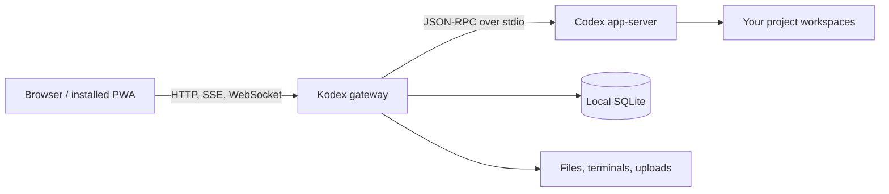

<p align="center">
  
</p>

# Kodex

Kodex is a self-hosted web workspace for [OpenAI Codex](https://github.com/openai/codex). It lets you run Codex on your own machine and work with it from a desktop or mobile browser, while keeping project files, terminals, and gateway-owned data on that machine.

A Rust gateway manages Codex and local capabilities, while a responsive React PWA provides the workspace.

> [!WARNING]
> Kodex does not provide gateway access control. Run it only on localhost or a trusted private network, and never expose it directly to the public internet. Its terminal and file-preview features can access the host with the permissions of the gateway process.

## At a glance

<p align="center">
  
</p>

<p align="center"><sub>Drag, resize, and rearrange Codex threads, terminals, and app surfaces in one desktop workspace, powered by <a href="https://dockview.dev/">Dockview</a>.</sub></p>

<p align="center">
  
</p>

<p align="center"><sub>Codex turns a live forecast request into an interactive weekly weather surface.</sub></p>

<p align="center">
  
</p>

<p align="center"><sub>Responsive UI on mobile devices</sub></p>

## What Kodex provides

- A project and thread workspace with draggable, resizable panes, live timelines, queued follow-ups, approvals, native sections and pins, and unread state.
- A responsive, installable web app for desktop, tablet, and phone browsers.
- Host terminals, local file previews, and uploads.
- Codex account, model, MCP server, plugin, skill, and app-surface controls.
- Recurring automations and optional browser notifications.
- Local persistence for gateway-owned state, while Codex app-server remains the transcript authority.

## How it works


```mermaid
flowchart LR
    Browser[Browser / installed PWA] -->|HTTP, SSE, WebSocket| Gateway[Kodex gateway]
    Gateway -->|JSON-RPC over stdio| Codex[Codex app-server]
    Gateway --> SQLite[(Local SQLite)]
    Gateway --> Host[Files, terminals, uploads]
    Codex --> Projects[Your project workspaces]
```

The gateway supervises an external `codex app-server`, translates its protocol into a browser-oriented API, brokers approvals, and owns local features such as terminals, automations, file serving, and notifications. The web client is a projection of gateway and app-server state rather than a second source of truth.

See [Architecture](docs/architecture.md) for component boundaries and state ownership.

## Quick start

You will need:

- Codex **0.160.0**, selected explicitly with `KODEX_CODEX_BINARY` (or that exact version on `PATH`).
- The stable Rust toolchain.
- Node.js and npm.

Start a disposable development instance while the [native redesign](plans/native-app-server-redesign.md) is underway:

```bash
KODEX_DATA_DIR="$(mktemp -d)/instance" KODEX_CODEX_BINARY=/absolute/path/to/codex cargo run -p kodex-gateway
```

In another terminal, start the web client:

```bash
cd apps/web
npm install
npm run dev
```

Open `http://127.0.0.1:5173`. The development server proxies API requests to the gateway at `http://127.0.0.1:8787`.

The new startup path defaults to `~/.kodex/native-v1/`: its gateway database, identity marker and `codex-home/` are independent of the old Kodex database and Codex desktop home. Nonempty unrecognized stores are rejected; no history, credentials, projects or schedules are imported. Sign in and configure the fresh instance deliberately. Production cutover remains gated on the redesign tests; do not point development runs at old stores.

Chat model and speed controls edit native settings for the next turn. Send and Queue use the effective native settings rather than repeating a browser snapshot. Changes appear after native application is confirmed; new-chat choices apply at creation. Full settings are readable after the first native turn starts. In Codex 0.160.0, speed returns to the configured default after an app-server restart.

Execution defaults and MCP setup use the native user config file and its version. MCP edits change only selected fields; untouched secrets and native policies remain intact. Existing servers keep their transport; add/remove provides the simpler workflow for changing it. A conflicting form keeps its draft until you explicitly review the latest configuration. Saving MCP configuration and requesting a runtime reload are separate outcomes; server status determines availability. Removing a user-layer value can reveal a value inherited from another native layer.

Sidebar sections use native ordering. Pinning moves a chat to Pinned; unpinning leaves it without a section. Section moves preserve its project and working directory. Custom sections can be renamed or deleted without deleting their chats.

The subagent viewer lists native persisted descendants, including unloaded children, with native cursor pagination. Discovery runs independently of the parent timeline. The viewer remains read-only. Opening a child separately disables input when native capability explicitly denies it; unknown capability stays unknown and native dispatch decides eligibility.

Skills use native selection rules. Free-text `$name` goes directly to Codex. The picker submits its exact selected path and structured token spans; a rejected Send or Queue preserves that selection for retry. Historical badges come from native stored input, without a gateway skill-metadata store or catalog lookup. A badge records the selection, not whether Codex expanded or executed the skill.

For prerequisites, tests, schema generation, and production-style static serving, see [Development](docs/development.md). For network binding, configuration and notifications, see [Deployment](docs/deployment.md).

## Repository map

| Path | Purpose |
| --- | --- |
| `apps/gateway` | Rust gateway, Codex app-server adapter, API, persistence, and host integrations |
| `apps/web` | React, TypeScript, and Vite progressive web app |
| `plugins/kodex-control` | First-party plugin for guarded agent access to Kodex |
| `docs` | Architecture, development, deployment, and maintenance guides |
| `plans` | Implementation history and future work |

## Documentation

- [Architecture](docs/architecture.md) — system shape, responsibilities, state ownership, and API boundaries.
- [Development](docs/development.md) — setup, local workflows, validation, and generated contracts.
- [Deployment](docs/deployment.md) — security assumptions, configuration, PWA updates, and Web Push.
- [Kodex Control](docs/kodex-control.md) — install and develop the bundled plugin and MCP server.
- [Plans](plans/index.md) — completed milestones, active work, and future extensions.

## Project status

Kodex is an actively developed personal project. The Rust gateway and React client are functional, but the security and deployment model remains deliberately local/private-network only. The repository no longer contains a native iOS client; mobile access is through the responsive PWA.

## License

Kodex is available under the [MIT License](LICENSE). See [Third-Party Notices](THIRD_PARTY_NOTICES.md) for attribution.

Kodex is an independent, unofficial project. It is not affiliated with or endorsed by OpenAI. Third-party names and marks belong to their respective owners.
