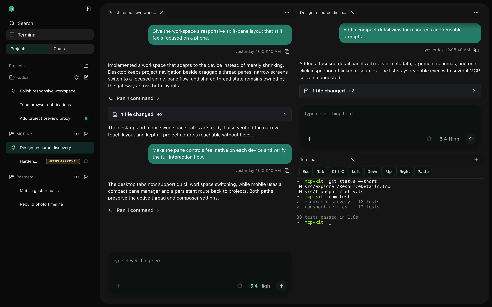
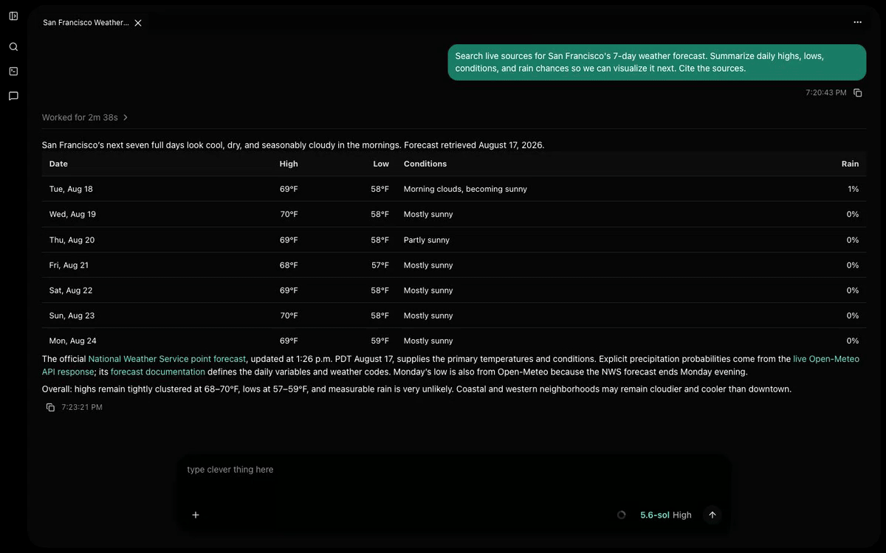
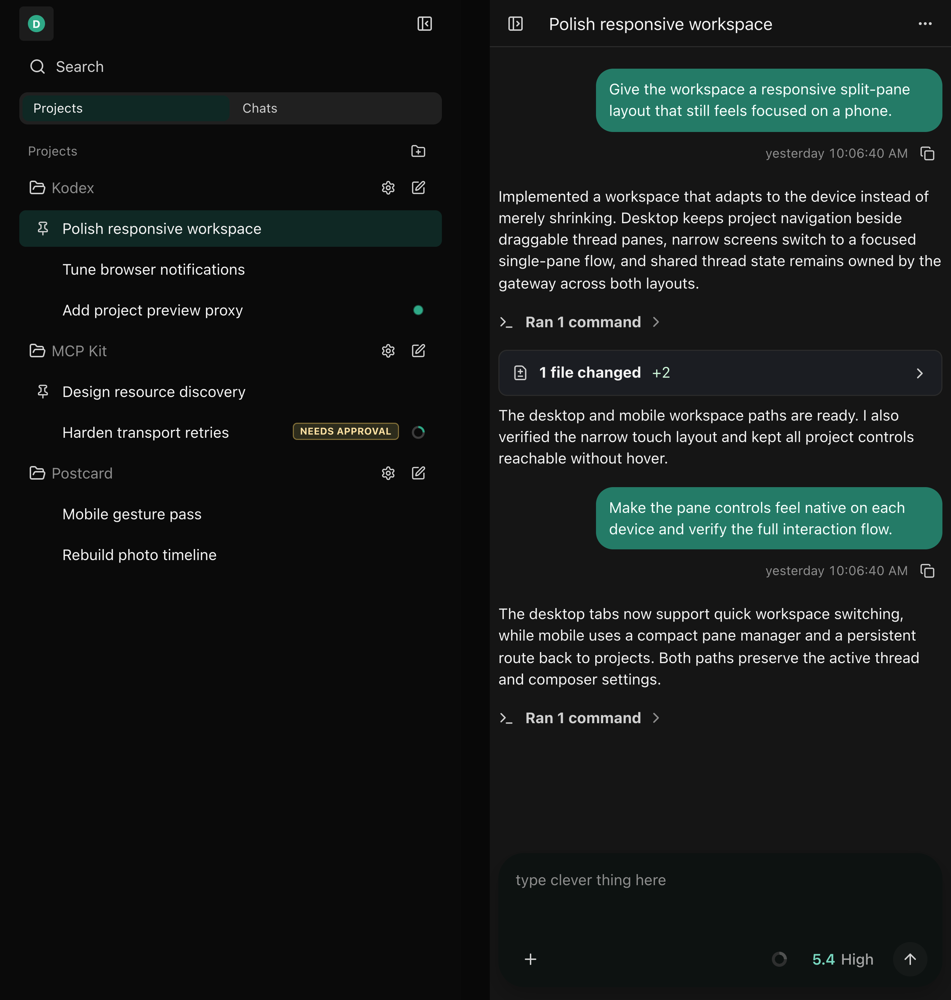
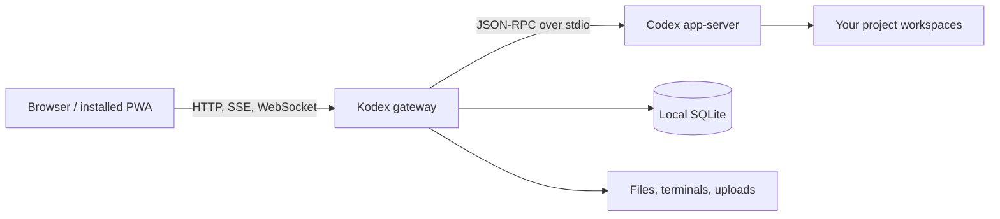

<p align="center">
  
</p>

# Kodex

Kodex is a self-hosted web workspace for [OpenAI Codex](https://github.com/openai/codex). It lets you run Codex on your own machine and work with it from a desktop or mobile browser, while keeping project files, terminals, and gateway-owned data on that machine.

A Rust gateway manages Codex and local capabilities, while a responsive React PWA provides the workspace.

> [!WARNING]
> Kodex does not provide gateway access control. Run it only on localhost or a trusted private network, and never expose it directly to the public internet. Its terminal and file-preview features can access the host with the permissions of the gateway process.

## At a glance

<p align="center">
  
</p>

<p align="center"><sub>Drag, resize, and rearrange Codex threads, terminals, and app surfaces in one desktop workspace, powered by <a href="https://dockview.dev/">Dockview</a>.</sub></p>

<p align="center">
  
</p>

<p align="center"><sub>Codex turns a live forecast request into an interactive weekly weather surface.</sub></p>

<p align="center">
  
</p>

<p align="center"><sub>Responsive UI on mobile devices</sub></p>

## What Kodex provides

- A project and thread workspace with draggable, resizable panes, live timelines, queued follow-ups, approvals, native pins, and unread state.
- A responsive, installable web app for desktop, tablet, and phone browsers.
- Host terminals, local file previews, and uploads.
- Codex account, model, MCP server, plugin, skill, and app-surface controls.
- Recurring automations and optional browser notifications.
- Local persistence for gateway-owned state, while Codex app-server remains the transcript authority.

## How it works


```mermaid
flowchart LR
    Browser[Browser / installed PWA] -->|HTTP, SSE, WebSocket| Gateway[Kodex gateway]
    Gateway -->|JSON-RPC over stdio| Codex[Codex app-server]
    Gateway --> SQLite[(Local SQLite)]
    Gateway --> Host[Files, terminals, uploads]
    Codex --> Projects[Your project workspaces]
```

The gateway supervises an external `codex app-server`, translates its protocol into a browser-oriented API, brokers approvals, and owns local features such as terminals, automations, file serving, and notifications. The web client is a projection of gateway and app-server state rather than a second source of truth.

See [Architecture](docs/architecture.md) for component boundaries and state ownership.

## Quick start

You will need:

- Codex **0.160.0**, selected explicitly with `KODEX_CODEX_BINARY` (or that exact version on `PATH`).
- The stable Rust toolchain.
- Node.js and npm.

Start a disposable development instance:

```bash
KODEX_DATA_DIR="$(mktemp -d)/instance" KODEX_CODEX_BINARY=/absolute/path/to/codex cargo run -p kodex-gateway
```

In another terminal, start the web client:

```bash
cd apps/web
npm install
npm run dev
```

Open `http://127.0.0.1:5173`. The development server proxies API requests to the gateway at `http://127.0.0.1:8787`.

The new startup path defaults to `~/.kodex/native-v1/`: its gateway database, identity marker and `codex-home/` are independent of the old Kodex database and Codex desktop home. The instance marker now uses format 4 for the reduced gateway schema; native lifecycle state and retired one-shot app submission fields are absent. Earlier marked instances are also rejected; select a new empty `KODEX_DATA_DIR` rather than migrating them. Nonempty unrecognized stores are rejected; no history, credentials, projects or schedules are imported. Sign in and configure the fresh instance deliberately. Production cutover remains gated on the redesign tests; do not point development runs at old stores.

Chat model and speed controls edit native settings for the next turn. Send and Queue use the effective native settings rather than repeating a browser snapshot. Changes appear after native application is confirmed; new-chat choices apply at creation. Full settings are readable after the first native turn starts. In Codex 0.160.0, speed returns to the configured default after an app-server restart.

Execution defaults and MCP setup use the native user config file and its version. MCP edits change only selected fields; untouched secrets and native policies remain intact. Existing servers keep their transport; add/remove provides the simpler workflow for changing it. A conflicting form keeps its draft until you explicitly review the latest configuration. Saving MCP configuration and requesting a runtime reload are separate outcomes; server status determines availability. Removing a user-layer value can reveal a value inherited from another native layer. Status preserves native connection state and discovery errors separately from authentication; unavailable runtime state is shown as unknown. OAuth uses native authorization URLs and completion notifications. The native callback is loopback by default. A remote browser needs callback routing back to that native listener, using native callback URL/port configuration and operator forwarding as needed. Kodex provides no OAuth callback relay.

Interactive MCP apps are imported from successful completed native calls, using native widget and account metadata. Chat history reads do not execute MCP requests; reopening uses the saved gateway artifact. Hosted app grants and bridge requests stay within the originating app/account, and generated app tool approvals bind the requested arguments and metadata. Kodex Control app tools require an explicit chat ID from this Kodex instance. Managed Codex children receive the actual gateway endpoint and executable, including on a custom or ephemeral port; ambient Control bindings cannot select another gateway.

Widget resource/catalog reads use one bounded runtime-local FIFO after canonical tool events publish. Slow reads cannot hold timeline or approval delivery. Generated replacement/archive fences older imports; disconnect, shutdown and overflow leave the text result available without an import retry or durable job store.

Project creation uses a directory browser rooted at the gateway user's home. Select one existing root; its folder name becomes the project name. The picker cannot navigate above home, including through symlinks. New project chats and project terminals use the sole project root automatically; projects with zero or multiple roots must be corrected before starting them. Existing chats retain their native working directory.

The sidebar contains Pinned, Projects, and standalone Chats. Pinning and pinned order use native app-server state and preserve a chat’s project and working directory. Kodex does not expose custom sections or section management. Chats with pre-existing native custom-section membership remain visible in their normal project/chat lists.

The subagent viewer lists native persisted descendants, including unloaded children, with native cursor pagination. Discovery runs independently of the parent timeline. The viewer remains read-only. Opening a child separately disables input when native capability explicitly denies it; unknown capability stays unknown and native dispatch decides eligibility.

Skills use native selection rules. Free-text `$name` goes directly to Codex. The picker submits its exact selected path and structured token spans; a rejected Send or Queue preserves that selection for retry. Historical badges come from native stored input, without a gateway skill-metadata store or catalog lookup. A badge records the selection, not whether Codex expanded or executed the skill.

Send delegates to native atomic start-or-steer. If native input is rejected, the draft stays available for an explicit retry or Queue; Kodex does not silently queue it. Each submission carries a native client-message ID so identical messages remain separate across live updates and history. These IDs correlate messages; they do not make retries idempotent. Queue is an explicit action in the composer’s “+” menu, including while Send can steer an active turn. Ordinary rows, edits, ordering and dispatch are native-owned; queued messages use execution-time chat settings. Stop preserves native pause, and explicit Start resumes that chat’s queue. After restart ordinary work stays dormant until its chat is loaded; Kodex does not restore a global queue drainer.

Failed turns show their native error in the timeline instead of appearing as successful work; interrupted turns show “Stopped” and any native interruption reason. These outcomes survive reload and reconnect, even when native timing or message items are absent. A fresh installed instance needs its own account sign-in: desktop or disposable-test credentials are not reused.

Queued-row Steer uses one continuous original-turn witness and a recoverable transfer record. It is unavailable after restart or loss of that turn’s context. Acceptance is distinct from a delivered native user message; uncertain transfers remain visible for bounded reconciliation or explicit recovery. Lost acknowledgments never trigger automatic requeue/resend. Restoring content to a composer does not establish non-delivery; inspect history before submitting it again. Unsupported native variants remain available as JSON rather than being silently discarded.

Automations activate their own immutable run targets and record native admission/dispatch correlation. Run history distinguishes native queued/dispatch state from uncertainty; dispatch is not completed inference. Scheduled admissions coalesce missed intervals and keep one outstanding admission, while Control run-now does not change schedule cadence. A lost admission/start acknowledgment remains uncertain without automatic replay. Reactivating an acknowledged queued target accepts native dispatch behavior: if native admission succeeded but queue cleanup failed, the existing row can dispatch again. Exactly-once execution is not guaranteed. Control input activates its explicit target and queues one native message, preserving the native pause policy and avoiding accidental steering of the user’s live turn. Control spawn keys allow one attempt: accepted responses can be read again, but an uncertain attempt requires inspection and a deliberate new key.

Opening or reconnecting an editable chat rejoins native execution and reads its recent history page through one canonical gateway command. Older history uses native cursors. The subagent observer reads history without activating the child; opening an unloaded internal child separately can encounter a native resume restriction. The recent window is bounded by turns, so one large turn can still contain many items.

Read state uses native completion IDs and an explicit acknowledgment of the completion shown in a visible chat pane. A stale acknowledgment cannot consume newer work. The badge counts eligible nonarchived chats across the native inventory, including chats outside the visible sidebar page. Unknown native history preserves the previous badge until a successful authoritative read; it never becomes a guessed zero. Reverting history while Kodex is offline can leave a chat conservatively unread until viewed again.

Terminals belong to the gateway, independently of app-server. Closing a pane detaches its view; ordinary Open terminal reuses a running shell, while New terminal creates another. Stop terminal explicitly ends that shell for all attached views. Reconnect and browser reload preserve its gateway buffer and process; gateway exit ends it. Detached shells expire after five minutes. Shell launches default to the dedicated Kodex home, with the host permissions of the gateway.

For prerequisites, tests, schema generation, and production-style static serving, see [Development](docs/development.md). For network binding, configuration and notifications, see [Deployment](docs/deployment.md).

## Repository map

| Path | Purpose |
| --- | --- |
| `apps/gateway` | Rust gateway, Codex app-server adapter, API, persistence, and host integrations |
| `apps/web` | React, TypeScript, and Vite progressive web app |
| `plugins/kodex-control` | First-party plugin for guarded agent access to Kodex |
| `docs` | Architecture, development, deployment, and maintenance guides |
| `plans` | Implementation history and future work |

## Documentation

- [Architecture](docs/architecture.md) — system shape, responsibilities, state ownership, and API boundaries.
- [Development](docs/development.md) — setup, local workflows, validation, and generated contracts.
- [Deployment](docs/deployment.md) — security assumptions, configuration, PWA updates, and Web Push.
- [Kodex Control](docs/kodex-control.md) — install and develop the bundled plugin and MCP server.
- [Plans](plans/index.md) — completed milestones, active work, and future extensions.

For persistent hosting on your Mac, use the [login service and update commands](docs/macos-service.md). The service runs a compiled release independently of your development checkout and works with private Tailscale HTTPS. It downloads the complete official Codex runtime pinned to the checked-in app-server schema and verifies its checksum; it does not extract binaries from the desktop app.

## Project status

The [native app-server redesign](plans/native-app-server-redesign.md) is validated for the intended personal-account deployment, including fresh sign-in and cold authenticated restart. Organization-managed storage confinement is unsupported. Target-device PWA checks were explicitly skipped and remain unverified. The subsequent [macOS login-service deployment](plans/macos-login-service.md) is installed and validated separately.

Kodex is an actively developed personal project. The Rust gateway and React client are functional, but the security and deployment model remains deliberately local/private-network only. The repository no longer contains a native iOS client; mobile access is through the responsive PWA.

## License

Kodex is available under the [MIT License](LICENSE). See [Third-Party Notices](THIRD_PARTY_NOTICES.md) for attribution.

Kodex is an independent, unofficial project. It is not affiliated with or endorsed by OpenAI. Third-party names and marks belong to their respective owners.

Browser builds carry an API compatibility epoch. After an incompatible gateway update, versioned browser writes are rejected and the UI asks for an explicit reload while keeping open drafts mounted. Save unsent work before accepting an update; passive tabs are not automatically reloaded. Older bundles shipped before this check require an initial manual update. Generate frontend API types from the checkout with `cd apps/web && npm run generate:api`; no running server is used.
